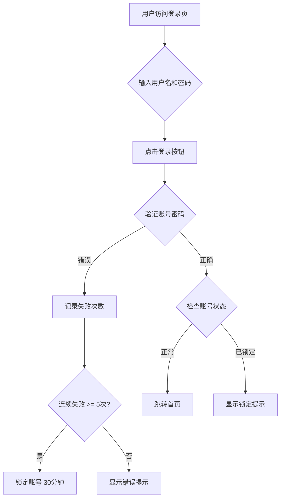

# 用户登录模块需求文档

## 文档概述

本文档描述用户登录模块的功能需求。用户可以通过用户名和密码登录系统，支持记住密码、密码找回，以及账号锁定等安全机制。

## 规划功能

### 业务流程图

### 具体功能设计

**登录功能**
- 用户名：支持邮箱或手机号，长度 6-50 字符
- 密码：长度 8-20 字符，区分大小写
- 支持"记住我"选项（7天有效期 Cookie）

**安全机制**
- 连续错误 5 次后锁定账号 30 分钟
- 锁定期间任何登录尝试均返回锁定提示
- 登录成功后清零失败计数

**密码找回**
- 通过注册邮箱发送重置链接
- 重置链接 2 小时有效

## 验收标准

1. 正确的用户名密码可成功登录，跳转到首页
2. 错误密码时显示"用户名或密码错误"提示
3. 连续 5 次错误后账号锁定，提示锁定剩余时间
4. 记住我功能在 7 天内免登录有效
5. 密码找回邮件 2 分钟内发送到注册邮箱
